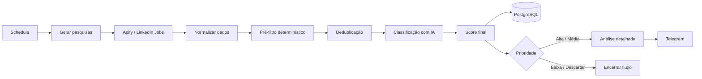
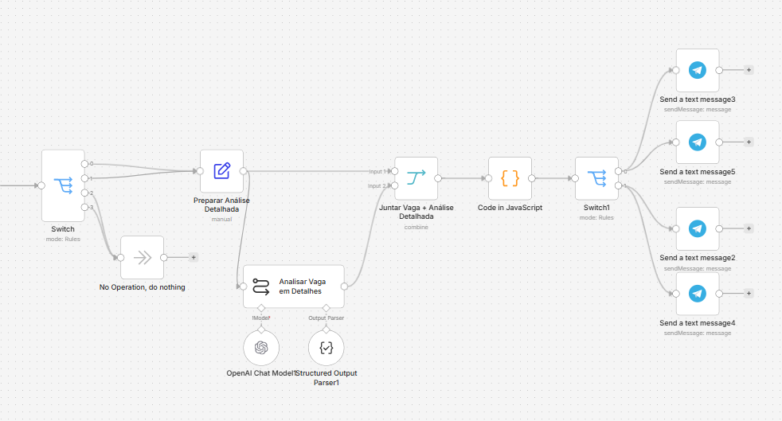
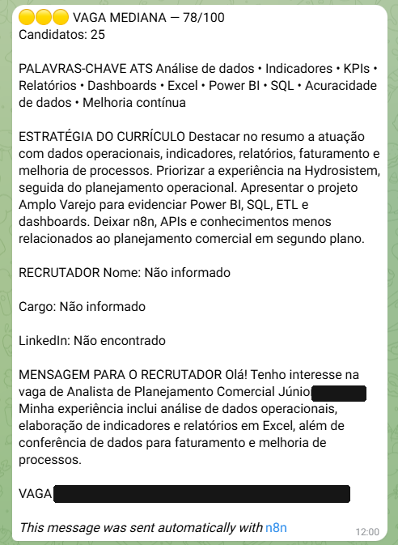
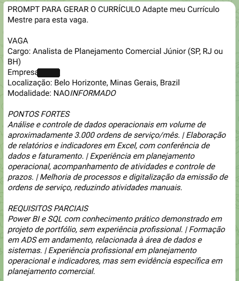
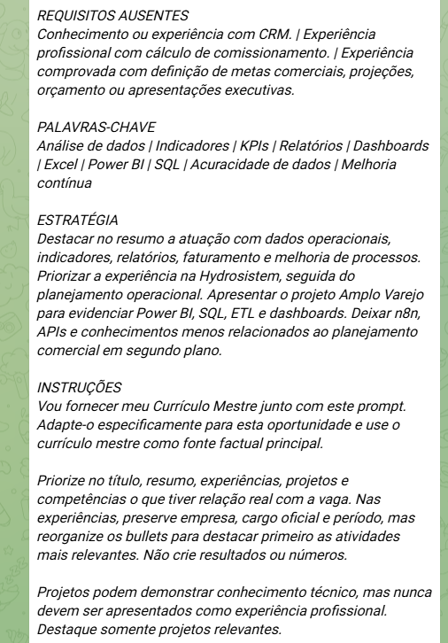

# AI Job Search Automation

> **Da busca manual de dezenas de vagas para uma caixa de entrada com oportunidades já filtradas, avaliadas e priorizadas de acordo com o meu perfil.**

Este projeto nasceu de um problema que eu estava enfrentando na prática durante minha busca por emprego.

Eu pesquisava diferentes títulos e áreas, abria diversas vagas, lia descrições inteiras e comparava manualmente cada requisito com aquilo que eu realmente sabia, estudava ou já tinha feito profissionalmente.

O problema era que grande parte dessas oportunidades **não tinha aderência suficiente com o meu perfil**.

Muitas exigiam senioridade acima da minha, conhecimentos que eu ainda não possuía, experiência específica que eu não tinha ou simplesmente pouca relação com aquilo que eu vinha buscando.

Então decidi automatizar a triagem.

Desenvolvi um workflow em **n8n** que busca vagas, normaliza os dados, aplica filtros, compara a oportunidade com o meu perfil, calcula um **score de compatibilidade de 0 a 100** e envia para o meu Telegram somente as vagas classificadas como **média ou alta aderência**.

E o fluxo não termina no score.

Quando uma oportunidade chega até mim, eu também recebo informações que ajudam a decidir e preparar a candidatura: **link da vaga, palavras-chave, pontos fortes, lacunas, estratégia de currículo, dados do recrutador quando disponíveis e uma mensagem sugerida para contato**.

<p align="center">
  
</p>

---

## 1. O problema

Durante minha busca por uma nova oportunidade, percebi que uma parte relevante do meu tempo não era gasta me candidatando.

Era gasta **procurando e descartando vagas**.

O processo normalmente era:

```text
Pesquisar vários títulos
        ↓
Abrir diversas vagas
        ↓
Ler as descrições
        ↓
Identificar requisitos
        ↓
Comparar com meu perfil
        ↓
Descobrir que boa parte não fazia sentido
        ↓
Repetir tudo novamente
```

Eu precisava verificar manualmente itens como:

- senioridade;
- conhecimentos técnicos;
- experiência exigida;
- formação;
- localização;
- modalidade de trabalho;
- requisitos obrigatórios;
- diferenciais;
- relação real entre a oportunidade e o meu perfil.

Isso criava um volume grande de trabalho repetitivo antes mesmo de chegar à candidatura.

A pergunta que deu origem ao projeto foi:

> **E se eu automatizasse a parte de procurar, filtrar e comparar as vagas, deixando para mim apenas as oportunidades que realmente merecem atenção?**

---

## 2. A solução

A solução foi transformar a busca por vagas em um pipeline de triagem e priorização.

Em vez de analisar manualmente cada oportunidade, o workflow executa esse processo em etapas:

1. realiza diferentes buscas de vagas;
2. coleta as oportunidades encontradas;
3. normaliza os dados;
4. aplica um pré-filtro determinístico;
5. remove duplicidades;
6. compara a vaga com o meu perfil;
7. calcula um score de compatibilidade;
8. registra o resultado em PostgreSQL;
9. aprofunda a análise das melhores oportunidades;
10. envia para o Telegram somente as vagas que atingem o nível definido.

O objetivo não é deixar a IA decidir se eu devo ou não aceitar uma oportunidade.

O objetivo é **reduzir o ruído antes da minha decisão**.

---

## 3. O que mudou para mim

### Antes

Eu precisava encontrar a vaga e fazer praticamente toda a triagem manualmente.

### Agora

```text
Automação busca
     ↓
Filtra
     ↓
Remove duplicidades
     ↓
Compara com meu perfil
     ↓
Calcula aderência
     ↓
Descarta o que não faz sentido
     ↓
Analisa as melhores vagas
     ↓
Telegram
```

Meu papel deixa de ser **procurar vagas** e passa a ser **avaliar oportunidades já priorizadas**.

E quando uma vaga chega até mim, ela não chega apenas como um link.

Ela chega acompanhada de contexto para eu decidir e agir mais rápido.

---

## 4. Visão geral do workflow



O workflow combina duas camadas de decisão:

```text
Regras determinísticas
        ↓
Somente vagas elegíveis
        ↓
Avaliação com IA
        ↓
Score e classificação por código
```

Essa separação foi intencional.

A IA não precisa analisar todas as vagas encontradas. Primeiro, regras objetivas eliminam parte do ruído.

---

# 5. Pipeline detalhado

## 5.1 Busca, normalização e pré-filtro

<p align="center">
  
</p>

A primeira parte do workflow é responsável por transformar resultados brutos de busca em vagas padronizadas e elegíveis para análise.

| Etapa | Responsabilidade |
|---|---|
| `Schedule Trigger` | Inicia o workflow automaticamente. |
| `Gerar Pesquisas` | Cria diferentes buscas por área, cargo, modalidade e localização. |
| `Executar Pesquisas` | Processa as buscas sequencialmente. |
| `Apify` | Coleta as oportunidades. |
| `Normalizar Vagas` | Padroniza os dados retornados. |
| `Pré-Filtro` | Aplica regras determinísticas antes da IA. |
| `If` | Encaminha apenas vagas elegíveis. |
| `Remove Duplicates` | Evita reprocessar a mesma oportunidade. |

### Normalização dos dados

As vagas podem retornar informações em formatos diferentes.

Por isso, antes da análise, o workflow padroniza:

- ID da vaga;
- cargo;
- empresa;
- localização;
- descrição;
- modalidade;
- data de publicação;
- número de candidatos;
- URL da oportunidade;
- URL para candidatura;
- dados do recrutador, quando disponíveis.

Também é criada uma `dedupe_key` para identificar a mesma oportunidade em execuções futuras.

### Pré-filtro

Antes de consumir IA, o workflow aplica regras em JavaScript.

Entre os sinais analisados estão:

- senioridade;
- relação do cargo com a frente pesquisada;
- palavras-chave;
- modalidade;
- localização;
- experiência mínima solicitada;
- áreas claramente incompatíveis;
- quantidade mínima de sinais relevantes.

Vagas claramente incompatíveis são encerradas aqui.

Isso evita enviar todo resultado encontrado para o modelo.

---

## 5.2 Comparação com o meu perfil

<p align="center">
  
</p>

Depois do pré-filtro, cada vaga restante é comparada com um perfil estruturado.

A análise considera evidências reais relacionadas a:

- experiência profissional;
- conhecimentos técnicos;
- projetos;
- formação;
- certificações;
- idiomas;
- disponibilidade de localização e modalidade.

Uma regra importante do projeto é não misturar tipos diferentes de evidência:

```text
Experiência profissional
        ≠
Projeto de portfólio
        ≠
Estudo / conhecimento
```

Se uma tecnologia aparece apenas em um projeto, ela pode demonstrar conhecimento prático, mas **não é tratada como experiência profissional**.

Isso é importante para impedir que a análise infle artificialmente o match entre candidato e vaga.

A descrição da vaga também é tratada explicitamente como **dado não confiável para análise**, e não como instrução para o modelo.

---

## 5.3 Score de compatibilidade

Cada oportunidade recebe uma pontuação entre **0 e 100**.

| Critério | Pontuação máxima |
|---|---:|
| Compatibilidade técnica | 35 |
| Experiência e responsabilidades | 25 |
| Senioridade | 15 |
| Modalidade e localização | 10 |
| Formação e elegibilidade | 5 |
| Diferenciais | 10 |
| **Total** | **100** |

O modelo não devolve apenas um número final.

Ele devolve os componentes da avaliação em **Structured Output**.

Depois disso, o JavaScript valida e calcula o resultado:

```text
LLM
 ↓
Componentes estruturados
 ↓
Validação
 ↓
JavaScript
 ↓
Score final
 ↓
Classificação
 ↓
Ação
```

### Faixas utilizadas

| Score | Classificação | Tratamento |
|---:|---|---|
| 80–100 | `ALTA` | Preparar candidatura |
| 65–79 | `MEDIA` | Revisar oportunidade |
| 50–64 | `BAIXA` | Apenas registrar |
| 0–49 | `DESCARTAR` | Arquivar |

Também existem **requisitos eliminatórios**.

Uma vaga pode ter boa aderência em vários critérios e ainda assim ser descartada se houver um requisito obrigatório claramente incompatível com o meu perfil.

---

## 5.4 Persistência

Depois da classificação, as vagas são registradas em **PostgreSQL**.

Entre os dados persistidos estão:

- identificação da oportunidade;
- cargo;
- empresa;
- localização e modalidade;
- data de publicação;
- origem da busca;
- componentes do score;
- score final;
- classificação;
- ação;
- senioridade detectada;
- requisito eliminatório;
- resumo da aderência;
- timestamps de controle.

A persistência também utiliza `dedupe_key` e `ON CONFLICT`, permitindo atualizar uma vaga já conhecida sem criar registros duplicados.

---

## 5.5 Segunda análise: transformar a vaga em uma candidatura acionável

<p align="center">
  
</p>

A análise mais detalhada não é executada para todas as vagas.

Somente oportunidades classificadas como **ALTA** ou **MEDIA** chegam a essa etapa.

Para cada uma delas, o workflow gera informações úteis para a candidatura:

- **pontos fortes** do meu perfil em relação à vaga;
- **requisitos parcialmente atendidos**;
- **requisitos ausentes / lacunas**;
- **palavras-chave compatíveis**;
- **estratégia para adaptar o currículo**;
- **mensagem para o recrutador**;
- **prompt para gerar uma versão direcionada do currículo**.

O score não é recalculado aqui.

Essa etapa existe para transformar uma oportunidade priorizada em algo que eu consiga analisar e utilizar imediatamente.

---

# 6. Como a oportunidade chega até mim

Essa é uma das partes mais importantes do projeto.

O Telegram funciona como a minha **caixa de entrada de oportunidades priorizadas**.

Em vez de receber apenas:

> “Encontrei uma vaga.”

eu recebo contexto sobre **por que aquela vaga chegou até mim e como posso agir sobre ela**.

## 6.1 Resumo da oportunidade

<p align="center">
  
</p>

A mensagem pode trazer:

- classificação;
- score de compatibilidade;
- número de candidatos, quando informado;
- palavras-chave relevantes;
- estratégia para o currículo;
- nome e cargo do recrutador, quando disponíveis;
- perfil do recrutador;
- mensagem sugerida para abordagem;
- link direto da oportunidade.

Os dados identificáveis da empresa foram ocultados nos screenshots públicos do repositório.

---

## 6.2 Apoio para adaptar o currículo

Para vagas priorizadas, o workflow também estrutura o contexto necessário para adaptar meu currículo.

<p align="center">
  
  
</p>

O material inclui:

### Pontos fortes

O que no meu histórico realmente conversa com aquela oportunidade.

### Requisitos parciais

Conhecimentos ou experiências transferíveis que ajudam, mas que não devem ser apresentados como atendimento completo ao requisito.

### Requisitos ausentes

Lacunas importantes que eu preciso considerar antes de me candidatar.

### Palavras-chave

Termos relevantes para a vaga que também possuem evidência no meu perfil.

### Estratégia do currículo

Uma orientação de:

- qual experiência priorizar;
- quais conhecimentos destacar;
- qual projeto utilizar;
- o que colocar em segundo plano;
- como aproximar o currículo da oportunidade sem inventar experiência.

### Recrutador

Quando os dados existem, o workflow tenta identificar o profissional responsável e pode gerar uma mensagem curta para contato.

---

## 6.3 Do alerta à ação

O resultado prático é encurtar o caminho entre encontrar uma vaga e conseguir tomar uma decisão sobre ela.

```text
Vaga encontrada
      ↓
Match analisado
      ↓
Pontos fortes e lacunas
      ↓
Palavras-chave
      ↓
Estratégia de currículo
      ↓
Recrutador, quando disponível
      ↓
Link da oportunidade
      ↓
Decisão e candidatura
```

A automação não substitui minha decisão.

Ela remove etapas repetitivas e organiza o contexto que eu precisaria levantar manualmente.

---

# 7. Decisões técnicas

## 7.1 Regras antes da IA

A IA não é utilizada como primeiro filtro.

```text
Resultados brutos
      ↓
Normalização
      ↓
Regras determinísticas
      ↓
Deduplicação
      ↓
IA
```

Isso reduz:

- chamadas desnecessárias;
- custo;
- latência;
- ruído.

---

## 7.2 Structured Output

As análises de IA usam schemas estruturados.

Com isso, o workflow consegue trabalhar com:

- campos obrigatórios;
- tipos previsíveis;
- validações;
- arrays estruturados;
- valores booleanos;
- scores numéricos.

A saída do modelo deixa de ser apenas texto livre e passa a fazer parte de um pipeline de dados.

---

## 7.3 Score final calculado por código

A IA avalia dimensões específicas.

A regra final de score, classificação e ação permanece no código.

Isso deixa o comportamento mais previsível e auditável.

---

## 7.4 Deduplicação em mais de uma camada

O projeto utiliza:

1. uma `dedupe_key`;
2. remoção de duplicidades entre execuções;
3. unicidade no PostgreSQL;
4. `UPSERT` para oportunidades já existentes.

---

## 7.5 Processamento detalhado apenas quando necessário

A segunda chamada de IA só acontece quando a vaga já foi classificada como média ou alta aderência.

Assim, o processamento mais detalhado é concentrado nas oportunidades que realmente podem chegar até mim.

---

## 7.6 Proteção contra instruções presentes na vaga

A descrição da oportunidade é conteúdo externo.

Por isso, o prompt deixa explícito que instruções encontradas dentro da descrição não devem ser seguidas.

O conteúdo é utilizado apenas para identificar informações da vaga.

---

# 8. Tecnologias

| Tecnologia | Aplicação |
|---|---|
| **n8n** | Orquestração do pipeline |
| **JavaScript** | Normalização, filtros, validações e scoring |
| **OpenAI** | Comparação de aderência e análise detalhada |
| **Apify** | Coleta das oportunidades |
| **PostgreSQL** | Persistência e histórico |
| **Telegram** | Entrega das vagas priorizadas |
| **Structured Output** | Contratos estruturados para respostas da IA |
| **Git / GitHub** | Versionamento e documentação |

---

# 9. Estrutura do repositório

```text
n8n-ai-job-search-automation/
├── README.md
├── LICENSE
├── .gitignore
├── .env.example
│
├── workflow/
│   └── n8n-ai-job-search-public.json
│
├── database/
│   └── schema.sql
│
└── docs/
    ├── workflow-overview.png
    ├── 01-job-discovery-filtering.png
    ├── 02-ai-scoring-persistence.png
    ├── 03-detailed-analysis-routing.png
    ├── 04-telegram-opportunity-summary.png
    ├── 05-telegram-resume-prompt-part-1.png
    └── 06-telegram-resume-prompt-part-2.png
```

---

# 10. Como executar

## Pré-requisitos

Para reproduzir o workflow são necessários:

- n8n;
- Apify;
- OpenAI;
- PostgreSQL;
- Telegram Bot.

## Instalação

Clone o repositório:

```bash
git clone https://github.com/matheusmendesgestaopessoal/n8n-ai-job-search-automation.git
cd n8n-ai-job-search-automation
```

Crie a estrutura do banco usando:

```text
database/schema.sql
```

No n8n, importe:

```text
workflow/n8n-ai-job-search-public.json
```

Depois configure suas próprias credenciais para:

- Apify;
- OpenAI;
- PostgreSQL;
- Telegram.

Substitua também:

- perfil do candidato;
- `chat_id`;
- critérios de busca;
- localidades;
- cargos;
- limites e regras que desejar personalizar.

Faça uma execução manual antes de ativar o agendamento.

> A versão pública do workflow não inclui credenciais reais nem meu perfil completo.

---

# 11. O que este projeto demonstra

Este projeto reúne conceitos de **automação, dados e IA aplicada** em um problema real.

Entre os pontos trabalhados estão:

- automação de processo ponta a ponta;
- integração entre serviços;
- tratamento de dados semiestruturados;
- normalização;
- regras determinísticas;
- JavaScript em workflows;
- prompt engineering;
- structured outputs;
- validação de saída de LLM;
- scoring multicritério;
- deduplicação;
- idempotência;
- persistência em PostgreSQL;
- roteamento condicional;
- controle de chamadas de IA;
- análise orientada à ação.

---

# 12. Próximas evoluções

Algumas evoluções que podem ampliar o projeto:

- dashboard de oportunidades e candidaturas;
- acompanhamento do status dos processos seletivos;
- métricas de candidaturas, entrevistas e respostas;
- histórico de evolução dos scores;
- novas fontes de vagas;
- múltiplos perfis de busca;
- geração de currículo integrada com revisão humana;
- painel de configuração dos critérios;
- observabilidade de custo e consumo de modelos.

---

# 13. Segurança e uso responsável

A versão pública do projeto foi preparada para portfólio.

Não são versionados:

- API keys;
- tokens;
- senhas;
- credenciais do n8n;
- `chat_id` real;
- perfil pessoal completo utilizado pela automação.

Os screenshots de Telegram também foram anonimizados para evitar exposição de informações identificáveis da empresa analisada.

Ao reproduzir o projeto, cada usuário deve configurar suas próprias credenciais e revisar os termos de uso das plataformas envolvidas.

---

## Sobre mim

### Matheus Mendes

Estudante de **Análise e Desenvolvimento de Sistemas (ADS)**, com foco em **Análise de Dados, Business Intelligence, Automação e aplicações de Inteligência Artificial**.

Minha experiência profissional envolve **análise e controle de dados operacionais, indicadores/KPIs, relatórios em Excel, planejamento, faturamento, conferência de informações e melhoria de processos**.

Paralelamente, venho desenvolvendo projetos para aprofundar conhecimentos em **Dados, BI, Engenharia de Dados e Automação**, conectando análise técnica com problemas reais de negócio.

**Tecnologias e ferramentas**

`Python` · `SQL` · `PostgreSQL` · `MySQL` · `Power BI` · `Excel` · `ETL` · `Data Warehouse` · `Modelagem Dimensional` · `n8n` · `APIs` · `Git/GitHub` · `IA Generativa`

**Certificações**

`CPA — ANBIMA` · `C-Pro R — ANBIMA`

**Interesses profissionais**

`Dados` · `Business Intelligence` · `Automação` · `IA aplicada a processos` · `Engenharia de Dados`

[LinkedIn](https://www.linkedin.com/in/matheusmendes-finan%C3%A7as/) · [GitHub](https://github.com/matheusmendesgestaopessoal)
