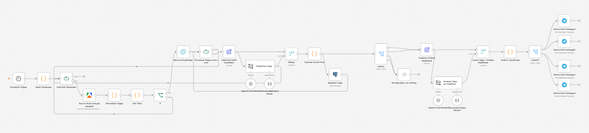
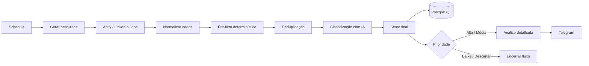
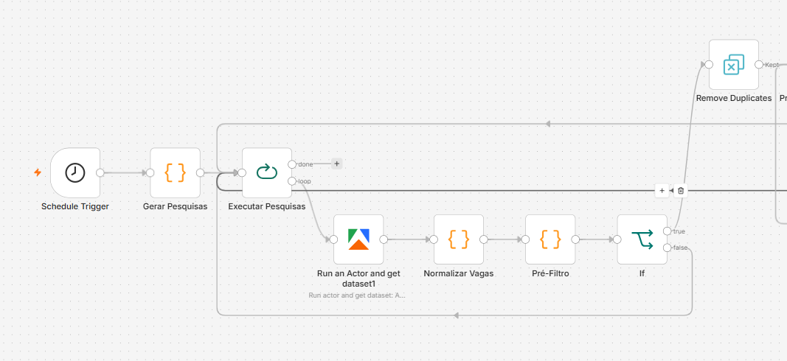
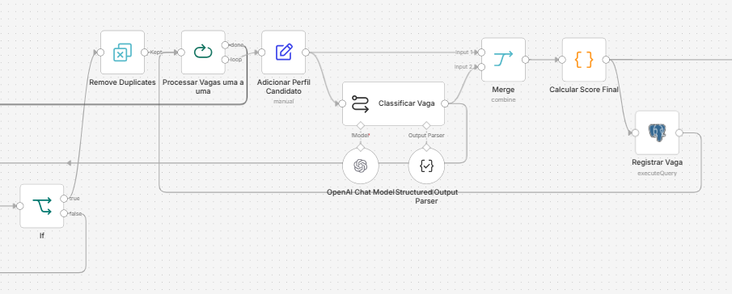

# AI Job Search Automation

Pipeline de automação desenvolvido em **n8n** para buscar, filtrar, classificar e priorizar vagas de forma automática, combinando regras determinísticas, inteligência artificial, persistência em PostgreSQL e notificações via Telegram.

O objetivo do projeto é reduzir o trabalho manual da busca por oportunidades e transformar uma lista de vagas em um fluxo de decisão estruturado: **coletar → validar → filtrar → analisar → priorizar → registrar → notificar**.

<p align="center">
  
</p>

---

## 1. Visão geral

A automação executa buscas programadas, coleta vagas, normaliza os dados retornados, elimina oportunidades claramente incompatíveis, remove duplicidades e utiliza IA apenas nas vagas que passaram pelo primeiro filtro.

Depois da análise, cada oportunidade recebe uma pontuação de aderência, uma classificação e uma ação sugerida. As vagas relevantes são registradas em PostgreSQL e passam por uma segunda análise para preparação da candidatura antes de serem enviadas ao Telegram.

### Fluxo principal



---

## 2. Problema

A busca manual por vagas envolve várias tarefas repetitivas:

- repetir pesquisas em diferentes cargos e localidades;
- abrir e ler diversas descrições;
- identificar senioridade e modalidade;
- comparar requisitos com o perfil do candidato;
- eliminar vagas incompatíveis;
- controlar oportunidades duplicadas;
- decidir quais vagas merecem prioridade;
- preparar currículo e abordagem ao recrutador.

O projeto automatiza essas etapas sem entregar toda a decisão diretamente ao modelo de IA.

---

## 3. Solução

A arquitetura utiliza **duas camadas de avaliação**.

A primeira é determinística e executada em JavaScript. Ela elimina ruído antes de qualquer chamada ao modelo.

A segunda utiliza IA para avaliar as vagas que realmente merecem análise, com saída estruturada e critérios de pontuação previamente definidos.

```text
Busca
  ↓
Normalização
  ↓
Pré-filtro por regras
  ↓
Deduplicação
  ↓
IA para aderência
  ↓
Score 0–100
  ↓
Persistência
  ↓
Análise detalhada das melhores vagas
  ↓
Telegram
```

Essa separação reduz chamadas desnecessárias ao modelo, melhora a previsibilidade do pipeline e deixa a lógica crítica mais fácil de auditar.

---

# 4. Pipeline

## 4.1 Coleta, normalização e pré-filtro

<p align="center">
  
</p>

A primeira parte do workflow é responsável por transformar resultados brutos de busca em vagas padronizadas e elegíveis para análise.

### Etapas

| Etapa | Responsabilidade |
|---|---|
| `Schedule Trigger` | Executa o workflow automaticamente em horário definido. |
| `Gerar Pesquisas` | Monta diferentes pesquisas por área, modalidade e localização. |
| `Executar Pesquisas` | Processa as pesquisas sequencialmente. |
| `Apify` | Executa o actor responsável pela coleta das vagas. |
| `Normalizar Vagas` | Padroniza cargo, empresa, localização, descrição, URLs, modalidade e dados do recrutador. |
| `Pré-Filtro` | Aplica regras determinísticas de senioridade, localização, cargo, experiência e palavras-chave. |
| `If` | Encaminha somente vagas consideradas elegíveis. |
| `Remove Duplicates` | Evita reprocessamento de oportunidades já encontradas. |

### Normalização

O workflow cria uma representação consistente para dados que podem chegar em formatos diferentes.

Entre os tratamentos estão:

- limpeza de HTML da descrição;
- URL canônica da vaga;
- URL canônica do recrutador;
- identificação da modalidade;
- normalização do número de candidatos;
- extração de recrutador ou job poster;
- validação de campos obrigatórios;
- geração de `dedupe_key`.

### Pré-filtro determinístico

Antes de consumir IA, a vaga recebe uma avaliação baseada em regras.

São considerados sinais como:

- senioridade;
- relação do cargo com a área pesquisada;
- palavras-chave relevantes;
- modalidade;
- localização;
- anos de experiência exigidos;
- cargos claramente fora do objetivo;
- estágio fora da área de interesse.

Somente vagas acima do limite definido seguem para a classificação com IA.

---

## 4.2 Classificação por IA e persistência

<p align="center">
  
</p>

Depois do pré-filtro, cada vaga é processada individualmente e comparada com um perfil estruturado do candidato.

A descrição da vaga é tratada explicitamente como **dado para análise**, não como instrução para o modelo. Isso reduz o risco de comandos existentes no conteúdo da vaga interferirem no comportamento do workflow.

### Critérios de aderência

| Critério | Peso máximo |
|---|---:|
| Compatibilidade técnica | 35 |
| Experiência e responsabilidades | 25 |
| Senioridade | 15 |
| Modalidade e localização | 10 |
| Formação e elegibilidade | 5 |
| Diferenciais | 10 |
| **Total** | **100** |

A IA retorna os componentes em **Structured Output**, e o cálculo final é realizado posteriormente por JavaScript.

Isso significa que o modelo não possui controle direto sobre a regra de classificação final.

### Classificação

| Score | Classificação | Ação |
|---:|---|---|
| 80–100 | `ALTA` | `PREPARAR_CANDIDATURA` |
| 65–79 | `MEDIA` | `REVISAR` |
| 50–64 | `BAIXA` | `REGISTRAR` |
| 0–49 | `DESCARTAR` | `ARQUIVAR` |

Quando existe um requisito realmente eliminatório, a vaga é classificada para descarte independentemente de uma boa pontuação em outros critérios.

### Persistência

As vagas classificadas são armazenadas em **PostgreSQL**.

O registro utiliza uma chave de deduplicação e `UPSERT`, permitindo atualizar uma vaga já conhecida sem criar registros duplicados.

Entre os dados armazenados estão:

- cargo;
- empresa;
- localização;
- modalidade;
- fonte;
- link;
- origem da busca;
- componentes do score;
- score final;
- classificação;
- ação;
- senioridade detectada;
- indicação de requisito eliminatório;
- resumo da aderência;
- timestamps de controle.

---

## 4.3 Análise detalhada e Telegram

<p align="center">
  
</p>

A análise mais cara e detalhada não é executada para todas as oportunidades.

Somente vagas classificadas como **ALTA** ou **MEDIA** seguem para essa etapa.

O segundo modelo recebe a vaga já classificada e produz informações úteis para a candidatura, sem recalcular o score.

### Saídas geradas

- pontos fortes do candidato para a vaga;
- requisitos parcialmente atendidos;
- requisitos sem evidência;
- palavras-chave compatíveis com ATS;
- estratégia para adaptação do currículo;
- mensagem curta para o recrutador;
- prompt estruturado para geração posterior do currículo.

O resultado é então enviado ao **Telegram**, priorizando as oportunidades que realmente merecem atenção.

---

# 5. Decisões técnicas

## 5.1 IA somente depois do pré-filtro

O modelo não é utilizado para avaliar todo resultado encontrado.

```text
Regras determinísticas
        ↓
somente vagas elegíveis
        ↓
análise com IA
```

Isso reduz custo, latência e ruído.

## 5.2 Structured Output

As duas etapas de IA utilizam schemas estruturados.

Isso permite:

- campos obrigatórios;
- tipos previsíveis;
- validação antes das próximas etapas;
- menor dependência de texto livre;
- processamento confiável pelo workflow.

## 5.3 Score calculado fora do modelo

A IA fornece componentes da avaliação, mas o score final e a classificação são calculados por código.

```text
LLM
 ↓
componentes estruturados
 ↓
JavaScript
 ↓
score + classificação + ação
```

## 5.4 Deduplicação em duas camadas

O pipeline utiliza:

1. `dedupe_key` gerada a partir do ID da vaga ou de atributos normalizados;
2. restrição de unicidade no PostgreSQL com `ON CONFLICT`.

Isso reduz duplicações tanto durante a execução quanto na persistência.

## 5.5 Segunda análise apenas para vagas relevantes

A geração de estratégia de candidatura acontece somente depois da classificação.

Assim, vagas de baixa aderência não consomem processamento detalhado.

## 5.6 Proteção contra instruções na descrição da vaga

O prompt de avaliação define a descrição como conteúdo não confiável utilizado somente para extração de requisitos.

Instruções presentes dentro da descrição devem ser ignoradas.

---

# 6. Tecnologias

| Tecnologia | Uso no projeto |
|---|---|
| **n8n** | Orquestração do workflow |
| **JavaScript** | Normalização, pré-filtro, validação e cálculo de score |
| **OpenAI** | Avaliação de aderência e análise detalhada |
| **Apify** | Coleta de oportunidades |
| **PostgreSQL** | Persistência e histórico das vagas |
| **Telegram** | Entrega das oportunidades priorizadas |
| **Structured Output** | Contratos previsíveis para respostas da IA |
| **Git / GitHub** | Versionamento e documentação |

---

# 7. Estrutura do repositório

```text
n8n-ai-job-search-automation/
├── README.md
├── LICENSE
├── .gitignore
├── .env.example
├── workflow/
│   └── n8n-ai-job-search-public.json
├── database/
│   └── schema.sql
└── docs/
    ├── workflow-overview.png
    ├── 01-job-discovery-filtering.png
    ├── 02-ai-scoring-persistence.png
    └── 03-detailed-analysis-telegram.png
```

---

# 8. Como executar

## Pré-requisitos

É necessário possuir:

- uma instância do n8n;
- conta no Apify;
- credencial de modelo OpenAI;
- PostgreSQL;
- bot do Telegram.

## Configuração

1. Clone o repositório.

```bash
git clone https://github.com/matheusmendesgestaopessoal/n8n-ai-job-search-automation.git
```

2. Crie a estrutura do banco usando:

```text
database/schema.sql
```

3. Importe no n8n:

```text
workflow/n8n-ai-job-search-public.json
```

4. Configure suas próprias credenciais no n8n para:

```text
Apify
OpenAI
PostgreSQL
Telegram
```

5. Substitua os dados de exemplo do perfil do candidato.

6. Configure o `chat_id` do Telegram.

7. Ajuste as pesquisas, cargos, localidades e critérios de acordo com o objetivo desejado.

8. Faça uma execução manual antes de ativar o agendamento.

> Nenhuma credencial real é versionada neste repositório.

---

# 9. O que este projeto demonstra

Mais do que conectar nodes no n8n, este projeto explora decisões comuns em automações orientadas por dados e IA:

- decomposição de um problema real em etapas;
- integração com APIs e serviços externos;
- normalização de dados semiestruturados;
- regras determinísticas antes de IA;
- prompt engineering;
- proteção contra conteúdo não confiável;
- structured outputs;
- scoring multicritério;
- deduplicação e idempotência;
- persistência relacional;
- roteamento condicional;
- otimização de chamadas de IA;
- notificações automáticas.

---

# 10. Próximas evoluções

- dashboard para acompanhamento das oportunidades;
- histórico do processo seletivo;
- métricas de candidaturas e respostas;
- acompanhamento de mudança de status;
- suporte a múltiplos perfis de candidato;
- novas fontes de vagas;
- geração automatizada de currículo com revisão humana;
- painel para configuração das regras de busca;
- observabilidade de custo e uso dos modelos.

---

# 11. Segurança e uso responsável

A versão pública do workflow não contém credenciais reais.

Ao utilizar o projeto:

- configure tokens e credenciais somente no credential manager do n8n;
- não versione secrets;
- não publique identificadores privados;
- revise os termos e políticas das plataformas utilizadas para coleta de dados;
- mantenha revisão humana antes de enviar candidaturas ou mensagens.

---

## Autor

**Matheus Mendes**

Projeto desenvolvido como parte de um portfólio de automação, dados e inteligência artificial.

[GitHub](https://github.com/matheusmendesgestaopessoal)
